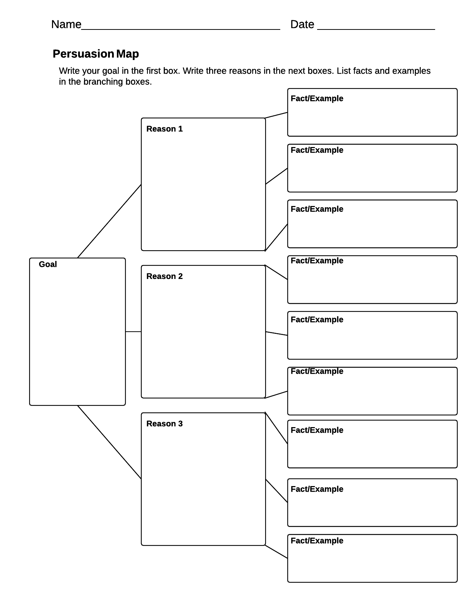

## About the System Security Plan  

The typical USA FedRAMP system security plan (SSP)
is written from a 304-page Microsoft document. See here:
https://www.fedramp.gov/resources/templates-2016

The first 12 sections are a narrative that is independent of the
structure of the controls that OpenControl specifies with `component.yaml` files. The table of contents for the initial 12
sections is like this:

```
1	Information System Name/Title	1
2	Information System Categorization	1
4	Authorizing Official	5
5	Other Designated Contacts	6
6	Assignment of Security Responsibility	7
7	Information System Operational Status	7
8	Information System Type	8
9	General System Description	10
10	System Environment	13
11	System Interconnections	16
12	Laws, Regulations, Standards, and Guidance	17
```

The content here could form the above 12-part narrative,
but doesn't. For a complete example, see:

https://github.com/18F/cg-compliance/tree/master/markdowns

## How are images included?

By including them with Markdown: ``````



### Include the Gap analysis

by running the command ```make coverage``` the output of the gap analysis is appended to the markdown file

Number of missing controls: 8
ncl@AC-10
ncl@AC-11
ncl@AC-12
ncl@AC-17
ncl@AC-18
ncl@AC-2
ncl@AC-2 (10)
ncl@AC-21
